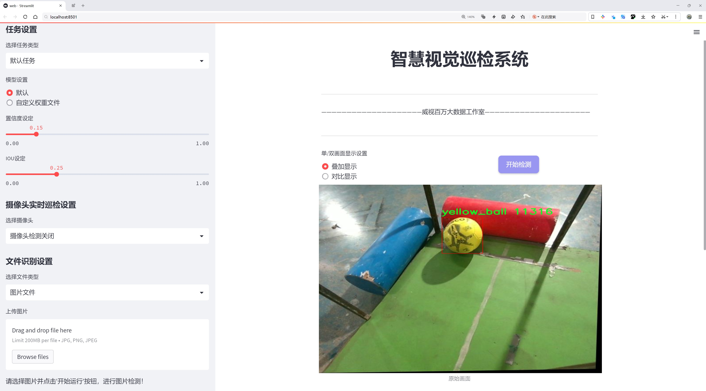
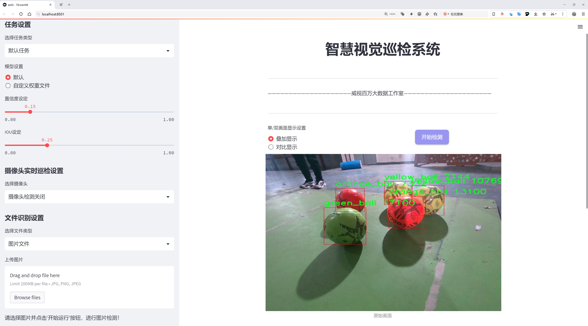
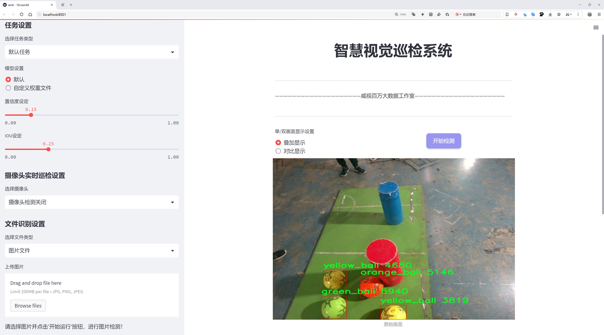
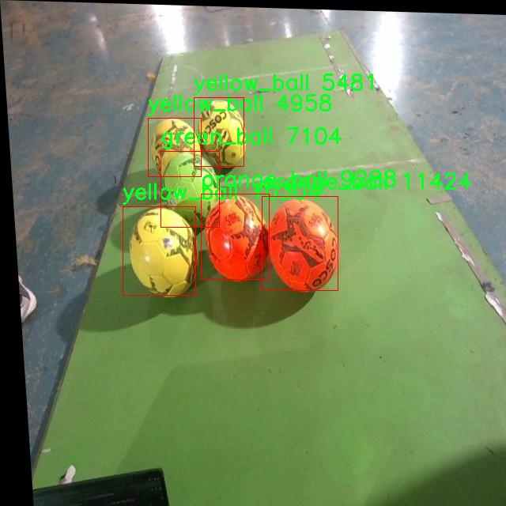
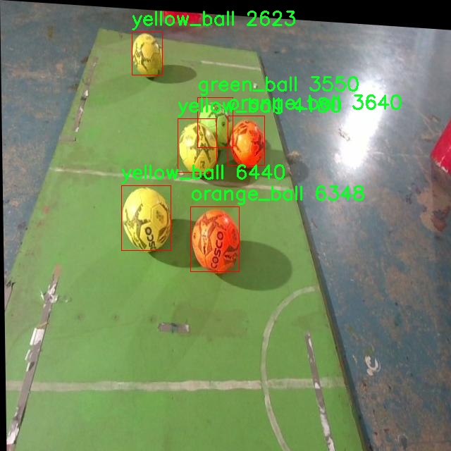
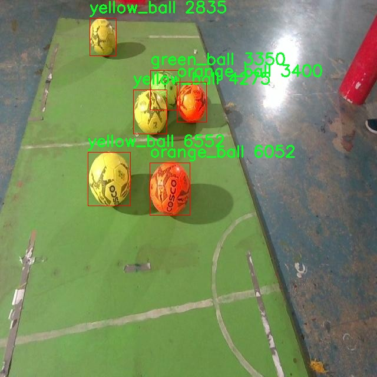
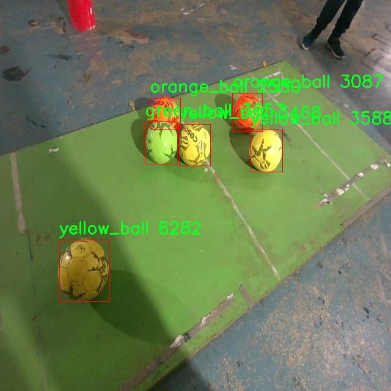
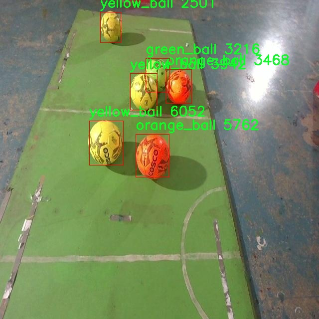

# 球类目标检测检测系统源码分享
 # [一条龙教学YOLOV8标注好的数据集一键训练_70+全套改进创新点发刊_Web前端展示]

### 1.研究背景与意义

项目参考[AAAI Association for the Advancement of Artificial Intelligence](https://gitee.com/qunshansj/projects)

项目来源[AACV Association for the Advancement of Computer Vision](https://gitee.com/qunmasj/projects)

研究背景与意义

随着计算机视觉技术的迅猛发展，目标检测作为其重要的研究方向之一，已在多个领域得到了广泛应用。尤其是在体育赛事、智能监控、无人驾驶等场景中，实时、准确的目标检测技术显得尤为重要。近年来，YOLO（You Only Look Once）系列模型因其高效的检测速度和良好的检测精度而受到广泛关注。YOLOv8作为该系列的最新版本，进一步提升了模型的性能，使其在复杂环境下的目标检测能力得到了显著增强。然而，针对特定目标的检测，尤其是球类目标的检测，仍然面临诸多挑战，如目标的形状多样性、颜色变化、光照条件的影响等。因此，基于改进YOLOv8的球类目标检测系统的研究具有重要的现实意义。

本研究所采用的数据集包含3400张图像，涵盖了四类球类目标：绿色球、橙色球、运动球和黄色球。这些数据的多样性为模型的训练提供了丰富的样本，能够有效提升模型对不同类型球类目标的识别能力。球类目标的检测不仅涉及到目标的外观特征，还需要考虑到运动状态、背景复杂度等因素。因此，如何在保持高检测精度的同时，提升模型的实时性和鲁棒性，成为了本研究的核心问题。

在实际应用中，球类目标的检测系统可以广泛应用于体育赛事的实时分析、运动员训练的辅助工具、以及智能监控系统中对运动物体的追踪与识别。通过对球类目标的准确检测，能够为教练和运动员提供有价值的数据支持，帮助他们分析比赛策略和运动表现。此外，在智能监控领域，基于球类目标的检测技术能够提高对运动物体的识别效率，为安全监控提供更为精准的解决方案。

本研究的意义不仅在于提升YOLOv8模型在球类目标检测中的应用效果，更在于推动计算机视觉技术在特定领域的深入发展。通过对YOLOv8模型的改进与优化，结合丰富的数据集，我们期望能够实现对球类目标的高效、准确检测。这一研究成果将为后续的相关研究提供重要的理论基础和实践指导，同时也为相关行业的技术进步贡献力量。

综上所述，基于改进YOLOv8的球类目标检测系统的研究，不仅具有重要的学术价值，也具有广泛的应用前景。通过深入探讨球类目标检测的关键技术与方法，我们期望能够为推动智能视觉技术的发展贡献一份力量，同时为相关领域的研究者提供新的思路与方向。

### 2.图片演示







##### 注意：由于此博客编辑较早，上面“2.图片演示”和“3.视频演示”展示的系统图片或者视频可能为老版本，新版本在老版本的基础上升级如下：（实际效果以升级的新版本为准）

  （1）适配了YOLOV8的“目标检测”模型和“实例分割”模型，通过加载相应的权重（.pt）文件即可自适应加载模型。

  （2）支持“图片识别”、“视频识别”、“摄像头实时识别”三种识别模式。

  （3）支持“图片识别”、“视频识别”、“摄像头实时识别”三种识别结果保存导出，解决手动导出（容易卡顿出现爆内存）存在的问题，识别完自动保存结果并导出到tempDir中。

  （4）支持Web前端系统中的标题、背景图等自定义修改，后面提供修改教程。

  另外本项目提供训练的数据集和训练教程,暂不提供权重文件（best.pt）,需要您按照教程进行训练后实现图片演示和Web前端界面演示的效果。

### 3.视频演示

[3.1 视频演示](https://www.bilibili.com/video/BV1Xjt7eAENM/)

### 4.数据集信息展示

##### 4.1 本项目数据集详细数据（类别数＆类别名）

nc: 3
names: ['green_ball', 'orange_ball', 'yellow_ball']


##### 4.2 本项目数据集信息介绍

数据集信息展示

在现代计算机视觉领域，目标检测技术的不断进步为各类应用提供了强大的支持。为了推动这一领域的发展，特别是在球类目标检测方面，我们构建了一个名为“jrmpssapp”的数据集。该数据集专门用于训练和改进YOLOv8模型，以实现对不同颜色球类的精准检测。数据集的设计考虑到了多样性和实用性，确保能够在多种场景下有效识别目标。

“jrmpssapp”数据集包含三种主要类别的球类目标，分别是绿色球、橙色球和黄色球。这三种颜色的选择不仅涵盖了常见的球类，还能够为模型提供丰富的视觉特征，以增强其泛化能力。每种类别的样本数量经过精心设计，确保模型在训练过程中能够学习到每种颜色球的独特特征，同时避免因样本不均衡而导致的过拟合问题。

在数据集的构建过程中，我们采用了多种拍摄角度和光照条件，以模拟真实世界中的复杂场景。这种多样化的样本收集策略使得“jrmpssapp”数据集不仅具备了良好的代表性，还能够有效应对不同环境下的挑战。例如，在阳光明媚的户外、阴暗的室内以及多种背景杂乱的场景中，数据集均提供了相应的样本。这种多样性将极大地提升YOLOv8模型在实际应用中的鲁棒性，使其能够在各种条件下稳定运行。

数据集中的每个样本都经过精确标注，确保每个球类目标的边界框和类别信息准确无误。这一过程不仅提高了数据集的质量，也为后续的模型训练提供了可靠的基础。通过高质量的标注，我们希望能够让YOLOv8模型更好地理解和识别不同颜色的球类目标，从而提升其检测精度。

此外，数据集的使用还考虑到了模型的训练效率。为了确保YOLOv8在训练过程中能够快速收敛，我们对数据集进行了合理的划分，包括训练集、验证集和测试集。这样的划分策略不仅有助于模型的评估和调优，还能够在不同阶段提供反馈，促进模型的持续改进。

总之，“jrmpssapp”数据集的构建旨在为球类目标检测提供一个高质量、高多样性的训练基础。通过对绿色球、橙色球和黄色球的精确标注与多样化场景的模拟，我们期望能够显著提升YOLOv8模型的检测性能。随着这一数据集的应用，我们相信在球类目标检测领域将会迎来新的突破，为相关应用提供更为精准和高效的解决方案。











### 5.全套项目环境部署视频教程（零基础手把手教学）

[5.1 环境部署教程链接（零基础手把手教学）](https://www.ixigua.com/7404473917358506534?logTag=c807d0cbc21c0ef59de5)


[5.2 安装Python虚拟环境创建和依赖库安装视频教程链接（零基础手把手教学）](https://www.ixigua.com/7404474678003106304?logTag=1f1041108cd1f708b01a)

### 6.手把手YOLOV8训练视频教程（零基础小白有手就能学会）

[6.1 手把手YOLOV8训练视频教程（零基础小白有手就能学会）](https://www.ixigua.com/7404477157818401292?logTag=d31a2dfd1983c9668658)

### 7.70+种全套YOLOV8创新点代码加载调参视频教程（一键加载写好的改进模型的配置文件）

[7.1 70+种全套YOLOV8创新点代码加载调参视频教程（一键加载写好的改进模型的配置文件）](https://www.ixigua.com/7404478314661806627?logTag=29066f8288e3f4eea3a4)

### 8.70+种全套YOLOV8创新点原理讲解（非科班也可以轻松写刊发刊，V10版本正在科研待更新）

由于篇幅限制，每个创新点的具体原理讲解就不一一展开，具体见下列网址中的创新点对应子项目的技术原理博客网址【Blog】：


[8.1 70+种全套YOLOV8创新点原理讲解链接](https://gitee.com/qunmasj/good)

### 9.系统功能展示（检测对象为举例，实际内容以本项目数据集为准）

图9.1.系统支持检测结果表格显示

  图9.2.系统支持置信度和IOU阈值手动调节

  图9.3.系统支持自定义加载权重文件best.pt(需要你通过步骤5中训练获得)

  图9.4.系统支持摄像头实时识别

  图9.5.系统支持图片识别

  图9.6.系统支持视频识别

  图9.7.系统支持识别结果文件自动保存

  图9.8.系统支持Excel导出检测结果数据


### 10.原始YOLOV8算法原理

原始YOLOv8算法原理

YOLOv8作为YOLO系列的最新成员，标志着目标检测技术的又一次飞跃。其设计理念和架构在前几代YOLO模型的基础上进行了深度优化，尤其是在检测精度和速度方面，YOLOv8展现出了显著的优势。该算法不仅整合了前沿的深度学习技术，还通过对模型结构的精简和改进，提升了实时检测的能力，使其在各种应用场景中表现出色。

YOLOv8的网络结构可以分为四个主要部分：输入端、骨干网络、颈部网络和头部网络。输入端采用了马赛克数据增强技术，这一策略通过将多张图像拼接在一起，增加了训练数据的多样性，从而提升了模型的泛化能力。此外，YOLOv8还引入了自适应锚框计算和自适应灰度填充，这些创新使得模型在处理不同尺寸和亮度的目标时更加灵活。

在骨干网络部分，YOLOv8采用了C2f模块和SPPF（Spatial Pyramid Pooling Fusion）结构。C2f模块的设计灵感来源于YOLOv7的ELAN结构，通过更多的分支和跨层连接，C2f模块能够有效地增强梯度流，进而提升特征表示能力。这种设计使得模型在特征提取过程中能够更好地捕捉到目标的细节信息，尤其是在复杂背景下的目标检测。SPPF模块则通过空间金字塔池化的方式，进一步提高了模型的计算速度和特征融合能力。

颈部网络采用了路径聚合网络（PAN）结构，这一设计旨在增强不同尺度对象的特征融合能力。PAN通过对特征图进行多尺度处理，能够有效地捕捉到小目标和大目标的特征信息，从而提升检测的准确性。与以往的YOLO版本相比，YOLOv8在特征融合的过程中引入了更为复杂的结构，使得模型在面对多样化的目标时，能够保持较高的检测精度。

头部网络是YOLOv8的一大亮点，其将分类和检测过程进行了有效的解耦。这一设计不仅简化了模型的结构，还提高了检测的效率。YOLOv8采用了Task-Aligned Assigner分配策略，根据分类与回归的分数加权结果选择正样本，确保了模型在训练过程中的高效性。损失计算方面，YOLOv8结合了二元交叉熵损失（BCELoss）、分布焦点损失（DFLoss）和完全交并比损失函数（CIOULoss），这些损失函数的组合使得模型在边界框预测的精准性上得到了显著提升。

值得注意的是，YOLOv8在头部网络中将传统的锚框检测方式替换为无锚框检测（Anchor-Free）策略。这一创新不仅减少了锚框预测的数量，还加速了非最大抑制（NMS）过程，从而提升了整体检测速度。这种无锚框的设计理念在目标检测领域中逐渐成为一种趋势，YOLOv8的成功应用进一步验证了这一思路的有效性。

YOLOv8的不同版本，如YOLOv8n、YOLOv8s、YOLOv8m等，针对不同的应用场景和需求进行了优化。YOLOv8n作为参数量最小且检测速度最快的版本，特别适合实时性要求高的应用场景。其在模型结构上进行了精简，通过调整不同尺度模型的通道数，确保了在保持高效检测的同时，模型的大小和复杂度得到了有效控制。

总的来说，YOLOv8的设计充分体现了深度学习领域的最新研究成果，其在网络结构、损失计算和特征融合等方面的创新，使得该算法在目标检测的准确性和速度上达到了新的高度。YOLOv8不仅为学术研究提供了新的思路，也为实际应用带来了广泛的可能性。随着YOLOv8的不断发展和完善，未来在更多领域的应用将会更加广泛，尤其是在自动驾驶、智能监控和机器人视觉等高需求场景中，YOLOv8无疑将发挥重要的作用。


### 11.项目核心源码讲解（再也不用担心看不懂代码逻辑）

#### 11.1 code\ultralytics\models\yolo\classify\train.py

以下是经过精简和注释的核心代码部分，主要集中在分类训练器的实现上：

```python
# 导入必要的库
import torch
from ultralytics.data import ClassificationDataset, build_dataloader
from ultralytics.engine.trainer import BaseTrainer
from ultralytics.models import yolo
from ultralytics.nn.tasks import ClassificationModel
from ultralytics.utils import DEFAULT_CFG, LOGGER

class ClassificationTrainer(BaseTrainer):
    """
    扩展自 BaseTrainer 类，用于基于分类模型的训练。
    """

    def __init__(self, cfg=DEFAULT_CFG, overrides=None, _callbacks=None):
        """初始化 ClassificationTrainer 对象，支持配置覆盖和回调函数。"""
        if overrides is None:
            overrides = {}
        overrides["task"] = "classify"  # 设置任务类型为分类
        if overrides.get("imgsz") is None:
            overrides["imgsz"] = 224  # 默认图像大小为224
        super().__init__(cfg, overrides, _callbacks)

    def set_model_attributes(self):
        """从加载的数据集中设置 YOLO 模型的类名。"""
        self.model.names = self.data["names"]

    def get_model(self, cfg=None, weights=None, verbose=True):
        """返回配置好的 PyTorch 模型以进行 YOLO 训练。"""
        model = ClassificationModel(cfg, nc=self.data["nc"], verbose=verbose)
        if weights:
            model.load(weights)  # 加载权重

        for m in model.modules():
            if hasattr(m, "reset_parameters"):
                m.reset_parameters()  # 重置模型参数
        for p in model.parameters():
            p.requires_grad = True  # 设置为可训练
        return model

    def build_dataset(self, img_path, mode="train"):
        """根据图像路径和模式（训练/测试等）创建 ClassificationDataset 实例。"""
        return ClassificationDataset(root=img_path, args=self.args, augment=mode == "train", prefix=mode)

    def get_dataloader(self, dataset_path, batch_size=16, rank=0, mode="train"):
        """返回用于推理的 PyTorch DataLoader，包含图像预处理变换。"""
        dataset = self.build_dataset(dataset_path, mode)  # 构建数据集
        loader = build_dataloader(dataset, batch_size, self.args.workers, rank=rank)  # 构建数据加载器
        return loader

    def preprocess_batch(self, batch):
        """预处理一批图像和类标签。"""
        batch["img"] = batch["img"].to(self.device)  # 将图像移动到设备
        batch["cls"] = batch["cls"].to(self.device)  # 将类标签移动到设备
        return batch

    def get_validator(self):
        """返回 ClassificationValidator 实例以进行验证。"""
        self.loss_names = ["loss"]  # 定义损失名称
        return yolo.classify.ClassificationValidator(self.test_loader, self.save_dir)

    def final_eval(self):
        """评估训练后的模型并保存验证结果。"""
        for f in self.last, self.best:
            if f.exists():
                if f is self.best:
                    LOGGER.info(f"\nValidating {f}...")
                    self.metrics = self.validator(model=f)  # 进行验证
        LOGGER.info(f"Results saved to {self.save_dir}")

    def plot_training_samples(self, batch, ni):
        """绘制带有注释的训练样本。"""
        plot_images(
            images=batch["img"],
            batch_idx=torch.arange(len(batch["img"])),
            cls=batch["cls"].view(-1),  # 将类标签展平
            fname=self.save_dir / f"train_batch{ni}.jpg",
        )
```

### 代码说明
1. **导入模块**：引入了 PyTorch 和 Ultralytics 库中的必要模块。
2. **ClassificationTrainer 类**：继承自 `BaseTrainer`，用于实现分类模型的训练。
3. **初始化方法**：设置默认参数和任务类型。
4. **模型属性设置**：从数据集中获取类名并设置到模型中。
5. **模型获取**：根据配置和权重加载模型，并设置可训练参数。
6. **数据集构建**：根据图像路径和模式创建数据集实例。
7. **数据加载器**：返回一个 PyTorch 数据加载器，包含图像预处理。
8. **批处理预处理**：将图像和类标签移动到指定设备（如 GPU）。
9. **验证器获取**：返回用于验证的实例。
10. **最终评估**：评估训练后的模型并保存结果。
11. **绘制训练样本**：可视化训练样本及其注释。

这些核心部分涵盖了分类训练的主要功能，便于理解和使用。

这个文件是一个用于训练分类模型的Python脚本，属于Ultralytics YOLO框架的一部分。它主要定义了一个名为`ClassificationTrainer`的类，该类继承自`BaseTrainer`，用于处理图像分类任务。

在类的初始化方法中，首先设置了一些默认配置，包括任务类型为“classify”，并确保图像大小（`imgsz`）为224。如果用户提供了其他配置（`overrides`），这些配置将被合并。

`set_model_attributes`方法用于从加载的数据集中设置YOLO模型的类名。这是为了确保模型能够正确识别和分类不同的图像类别。

`get_model`方法返回一个配置好的PyTorch模型，适用于YOLO训练。如果提供了权重文件，它会加载这些权重。此方法还会重置模型中的某些参数，并设置模型的训练模式。

`setup_model`方法负责加载或创建模型。如果模型已经是一个PyTorch模块，则不需要再次设置。它支持从本地文件、Torchvision模型或Ultralytics资产中加载YOLO模型。此方法还会根据数据集的类别数量调整模型的输出。

`build_dataset`方法根据给定的图像路径和模式（如训练或测试）创建一个`ClassificationDataset`实例。`get_dataloader`方法则返回一个PyTorch的DataLoader，用于预处理图像并进行批量加载。

`preprocess_batch`方法负责将图像和类别数据移动到指定的设备（如GPU）上，以便进行训练。

`progress_string`方法返回一个格式化的字符串，用于显示训练进度，包括当前的epoch、GPU内存使用情况和损失值等信息。

`get_validator`方法返回一个用于验证的`ClassificationValidator`实例，并设置损失名称。

`label_loss_items`方法返回一个带有标签的损失字典，尽管对于分类任务并不需要，但对于分割和检测任务是必要的。

`plot_metrics`方法用于从CSV文件中绘制训练过程中记录的指标，并保存结果图像。

`final_eval`方法在训练结束后评估训练好的模型，并保存验证结果。它会处理最后一次和最佳模型文件，去除优化器信息，并记录验证过程中的信息。

最后，`plot_training_samples`方法用于绘制训练样本及其注释，以便于可视化训练数据的效果。

整体来看，这个文件实现了一个完整的分类模型训练流程，包括模型的设置、数据加载、训练过程管理和结果评估等功能。

#### 11.2 code\ultralytics\models\yolo\detect\predict.py

以下是代码中最核心的部分，并附上详细的中文注释：

```python
from ultralytics.engine.predictor import BasePredictor
from ultralytics.engine.results import Results
from ultralytics.utils import ops

class DetectionPredictor(BasePredictor):
    """
    DetectionPredictor类，继承自BasePredictor类，用于基于检测模型进行预测。
    """

    def postprocess(self, preds, img, orig_imgs):
        """
        对预测结果进行后处理，并返回Results对象的列表。

        参数:
        preds: 模型的预测结果
        img: 输入图像
        orig_imgs: 原始图像列表或张量

        返回:
        results: 包含处理后结果的Results对象列表
        """
        # 应用非极大值抑制（NMS）来过滤重叠的检测框
        preds = ops.non_max_suppression(
            preds,
            self.args.conf,  # 置信度阈值
            self.args.iou,    # IOU阈值
            agnostic=self.args.agnostic_nms,  # 是否进行类别无关的NMS
            max_det=self.args.max_det,  # 最大检测框数量
            classes=self.args.classes,    # 需要检测的类别
        )

        # 如果输入的原始图像不是列表，则将其转换为numpy数组
        if not isinstance(orig_imgs, list):  # 输入图像是torch.Tensor，而不是列表
            orig_imgs = ops.convert_torch2numpy_batch(orig_imgs)

        results = []  # 初始化结果列表
        for i, pred in enumerate(preds):  # 遍历每个预测结果
            orig_img = orig_imgs[i]  # 获取对应的原始图像
            # 将预测框的坐标缩放到原始图像的尺寸
            pred[:, :4] = ops.scale_boxes(img.shape[2:], pred[:, :4], orig_img.shape)
            img_path = self.batch[0][i]  # 获取图像路径
            # 创建Results对象并添加到结果列表
            results.append(Results(orig_img, path=img_path, names=self.model.names, boxes=pred))
        return results  # 返回处理后的结果列表
```

### 代码注释说明：
1. **类定义**：`DetectionPredictor`类用于处理检测模型的预测，继承自`BasePredictor`。
2. **后处理方法**：`postprocess`方法对模型的预测结果进行后处理，主要包括应用非极大值抑制（NMS）和缩放预测框。
3. **非极大值抑制**：通过`ops.non_max_suppression`函数过滤掉重叠的检测框，以提高检测的准确性。
4. **图像转换**：检查原始图像是否为列表，如果不是，则将其转换为numpy数组，以便后续处理。
5. **结果构建**：遍历每个预测结果，缩放预测框并创建`Results`对象，最终返回所有结果的列表。

这个程序文件是Ultralytics YOLO模型中的一个预测模块，主要用于基于检测模型进行预测。文件中定义了一个名为`DetectionPredictor`的类，该类继承自`BasePredictor`，用于处理图像检测任务。

在类的文档字符串中，提供了一个示例，展示了如何使用这个预测器。用户可以通过传入模型文件路径和数据源来初始化`DetectionPredictor`对象，并调用`predict_cli()`方法进行预测。

类中定义了一个`postprocess`方法，该方法负责对模型的预测结果进行后处理。具体来说，它使用非极大值抑制（Non-Maximum Suppression, NMS）来过滤掉重叠的检测框，保留置信度高的框。方法的参数包括预测结果`preds`、输入图像`img`和原始图像`orig_imgs`。

在处理过程中，首先调用`ops.non_max_suppression`函数进行NMS，使用类的参数如置信度阈值、IOU阈值等进行过滤。接着，检查输入的原始图像是否为列表，如果不是，则将其转换为NumPy数组。接下来，循环遍历每个预测结果，将检测框的坐标缩放到原始图像的尺寸，并将结果封装成`Results`对象，最后返回这些结果。

总的来说，这个文件的核心功能是实现对YOLO模型预测结果的后处理，确保最终输出的检测结果准确且符合用户需求。

#### 11.3 ui.py

以下是代码中最核心的部分，并附上详细的中文注释：

```python
import sys
import subprocess

def run_script(script_path):
    """
    使用当前 Python 环境运行指定的脚本。

    Args:
        script_path (str): 要运行的脚本路径

    Returns:
        None
    """
    # 获取当前 Python 解释器的路径
    python_path = sys.executable

    # 构建运行命令，使用 streamlit 运行指定的脚本
    command = f'"{python_path}" -m streamlit run "{script_path}"'

    # 执行命令
    result = subprocess.run(command, shell=True)
    # 检查命令执行的返回码，如果不为0则表示出错
    if result.returncode != 0:
        print("脚本运行出错。")

# 实例化并运行应用
if __name__ == "__main__":
    # 指定要运行的脚本路径
    script_path = "web.py"  # 这里可以替换为实际的脚本路径

    # 调用函数运行脚本
    run_script(script_path)
```

### 代码说明：
1. **导入模块**：
   - `sys`：用于访问与 Python 解释器相关的变量和函数。
   - `subprocess`：用于执行外部命令。

2. **`run_script` 函数**：
   - 接受一个参数 `script_path`，表示要运行的 Python 脚本的路径。
   - 使用 `sys.executable` 获取当前 Python 解释器的路径。
   - 构建一个命令字符串，使用 `streamlit` 模块运行指定的脚本。
   - 使用 `subprocess.run` 执行构建的命令，并通过 `shell=True` 允许在 shell 中执行。
   - 检查命令的返回码，如果返回码不为0，表示脚本运行出错，打印错误信息。

3. **主程序块**：
   - 当脚本作为主程序运行时，指定要运行的脚本路径（这里是 `web.py`）。
   - 调用 `run_script` 函数执行指定的脚本。

这个程序文件的主要功能是使用当前的 Python 环境来运行一个指定的脚本，具体来说是一个名为 `web.py` 的脚本。程序首先导入了必要的模块，包括 `sys`、`os` 和 `subprocess`，以及一个自定义的 `abs_path` 函数，用于获取文件的绝对路径。

在 `run_script` 函数中，首先获取当前 Python 解释器的路径，这样可以确保在正确的环境中运行脚本。接着，构建一个命令字符串，该命令使用 `streamlit` 模块来运行指定的脚本。这里使用了 `subprocess.run` 方法来执行这个命令，并通过 `shell=True` 参数来允许在 shell 中执行命令。

如果脚本运行过程中出现错误，程序会检查返回码 `result.returncode`，如果不为零，则输出一条错误信息，提示用户脚本运行出错。

在文件的最后部分，使用 `if __name__ == "__main__":` 语句来确保只有在直接运行该文件时才会执行后面的代码。在这里，程序指定了要运行的脚本路径 `web.py`，并调用 `run_script` 函数来执行这个脚本。

总体来说，这个程序的结构清晰，功能单一，主要用于在当前 Python 环境中启动一个 Streamlit 应用。

#### 11.4 70+种YOLOv8算法改进源码大全和调试加载训练教程（非必要）\ultralytics\models\sam\modules\tiny_encoder.py

以下是代码中最核心的部分，并附上详细的中文注释：

```python
import torch
import torch.nn as nn
import torch.nn.functional as F

class Conv2d_BN(torch.nn.Sequential):
    """一个顺序容器，执行2D卷积操作，后接批量归一化。"""

    def __init__(self, in_channels, out_channels, kernel_size=1, stride=1, padding=0, dilation=1, groups=1, bn_weight_init=1):
        """初始化卷积层和批量归一化层。"""
        super().__init__()
        # 添加卷积层
        self.add_module('c', torch.nn.Conv2d(in_channels, out_channels, kernel_size, stride, padding, dilation, groups, bias=False))
        # 添加批量归一化层
        bn = torch.nn.BatchNorm2d(out_channels)
        # 初始化批量归一化的权重和偏置
        torch.nn.init.constant_(bn.weight, bn_weight_init)
        torch.nn.init.constant_(bn.bias, 0)
        self.add_module('bn', bn)


class PatchEmbed(nn.Module):
    """将图像嵌入为补丁，并将其投影到指定的嵌入维度。"""

    def __init__(self, in_chans, embed_dim, resolution, activation):
        """初始化补丁嵌入层。"""
        super().__init__()
        img_size = (resolution, resolution)  # 假设输入为正方形图像
        self.patches_resolution = (img_size[0] // 4, img_size[1] // 4)  # 每个补丁的分辨率
        self.in_chans = in_chans  # 输入通道数
        self.embed_dim = embed_dim  # 嵌入维度
        n = embed_dim
        # 构建序列，包括两个卷积层
        self.seq = nn.Sequential(
            Conv2d_BN(in_chans, n // 2, 3, 2, 1),  # 第一个卷积层
            activation(),  # 激活函数
            Conv2d_BN(n // 2, n, 3, 2, 1),  # 第二个卷积层
        )

    def forward(self, x):
        """通过补丁嵌入模型的操作序列运行输入张量 'x'。"""
        return self.seq(x)


class Attention(torch.nn.Module):
    """多头注意力模块，支持空间感知，应用基于空间分辨率的注意力偏置。"""

    def __init__(self, dim, key_dim, num_heads=8, attn_ratio=4, resolution=(14, 14)):
        """初始化注意力模块。"""
        super().__init__()
        self.num_heads = num_heads  # 注意力头数
        self.scale = key_dim ** -0.5  # 缩放因子
        self.key_dim = key_dim  # 键的维度
        self.d = int(attn_ratio * key_dim)  # 值的维度
        self.dh = self.d * num_heads  # 总的值的维度

        # 定义层归一化和线性变换
        self.norm = nn.LayerNorm(dim)
        self.qkv = nn.Linear(dim, self.dh + key_dim * num_heads * 2)  # 查询、键、值的线性变换
        self.proj = nn.Linear(self.dh, dim)  # 输出线性变换

    def forward(self, x):
        """对输入张量 'x' 执行前向传播。"""
        B, N, _ = x.shape  # B: 批量大小, N: 序列长度, C: 特征维度

        # 归一化
        x = self.norm(x)

        # 计算查询、键、值
        qkv = self.qkv(x).view(B, N, self.num_heads, -1).split([self.key_dim, self.key_dim, self.d], dim=3)
        q, k, v = [t.permute(0, 2, 1, 3) for t in qkv]  # 转置以适应多头注意力

        # 计算注意力
        attn = (q @ k.transpose(-2, -1)) * self.scale  # 计算注意力得分
        attn = attn.softmax(dim=-1)  # 归一化为概率分布
        x = (attn @ v).transpose(1, 2).reshape(B, N, self.dh)  # 计算加权和

        return self.proj(x)  # 输出


class TinyViT(nn.Module):
    """TinyViT架构，用于视觉任务。"""

    def __init__(self, img_size=224, in_chans=3, num_classes=1000, embed_dims=[96, 192, 384, 768], depths=[2, 2, 6, 2], num_heads=[3, 6, 12, 24], window_sizes=[7, 7, 14, 7], mlp_ratio=4., drop_rate=0., drop_path_rate=0.1, use_checkpoint=False):
        """初始化TinyViT模型。"""
        super().__init__()
        self.img_size = img_size  # 输入图像大小
        self.num_classes = num_classes  # 分类类别数
        self.depths = depths  # 每层的深度
        self.num_layers = len(depths)  # 层数
        self.mlp_ratio = mlp_ratio  # MLP隐藏维度与嵌入维度的比率

        # 初始化补丁嵌入层
        self.patch_embed = PatchEmbed(in_chans=in_chans, embed_dim=embed_dims[0], resolution=img_size, activation=nn.GELU)

        # 构建层
        self.layers = nn.ModuleList()
        for i_layer in range(self.num_layers):
            layer = BasicLayer(dim=embed_dims[i_layer], input_resolution=(img_size // (2 ** i_layer), img_size // (2 ** i_layer)), depth=depths[i_layer], num_heads=num_heads[i_layer], window_size=window_sizes[i_layer], mlp_ratio=self.mlp_ratio, drop=drop_rate)
            self.layers.append(layer)

        # 分类头
        self.head = nn.Linear(embed_dims[-1], num_classes) if num_classes > 0 else torch.nn.Identity()

    def forward(self, x):
        """执行前向传播。"""
        x = self.patch_embed(x)  # 通过补丁嵌入层
        for layer in self.layers:
            x = layer(x)  # 通过每一层
        return self.head(x)  # 通过分类头
```

### 代码核心部分说明：
1. **Conv2d_BN**: 这个类实现了一个卷积层后接批量归一化的结构，方便构建深度神经网络。
2. **PatchEmbed**: 该类将输入图像划分为多个补丁，并将其嵌入到指定的维度，通常用于视觉任务的输入处理。
3. **Attention**: 实现了多头注意力机制，允许模型在不同的头上学习不同的特征，增强了模型的表达能力。
4. **TinyViT**: 这是整个模型的主体，负责构建网络的不同层次，包括补丁嵌入、多个基本层和最终的分类头。

这些核心部分共同构成了TinyViT模型的基础，适用于各种视觉任务。

这个程序文件实现了一个名为TinyViT的视觉模型架构，主要用于图像处理任务。该模型结合了卷积神经网络（CNN）和自注意力机制，旨在提高计算效率和模型性能。文件中包含多个类，每个类实现了模型的不同组成部分。

首先，文件引入了一些必要的库，包括PyTorch和相关的模块。接着，定义了几个基础类，例如`Conv2d_BN`，它是一个简单的卷积层，后接批归一化（Batch Normalization），用于加速训练和提高模型的稳定性。

`PatchEmbed`类负责将输入图像分割成小块（patches），并将这些小块映射到指定的嵌入维度。这个过程是TinyViT模型的关键步骤之一，因为它将图像信息转化为适合后续处理的形式。

`MBConv`类实现了移动反向瓶颈卷积层，这是EfficientNet架构中的一个重要组成部分。该层通过扩展和压缩卷积操作来提高模型的效率，同时使用激活函数增加非线性。

`PatchMerging`类则用于合并相邻的小块特征图，并将其投影到新的维度。这一过程有助于减少特征图的尺寸，同时保留重要的信息。

`ConvLayer`类是一个包含多个MBConv层的卷积层，支持下采样操作和梯度检查点（gradient checkpointing），后者用于在训练过程中节省内存。

`Mlp`类实现了多层感知机（MLP），用于在模型中进行特征转换。它包含层归一化和两个全连接层，通常用于提升模型的表达能力。

`Attention`类实现了多头自注意力机制，允许模型在处理输入时关注不同的特征区域。该类支持空间感知，能够根据输入特征图的空间分辨率应用注意力偏置。

`TinyViTBlock`类是TinyViT模型的基本构建块，结合了自注意力和局部卷积操作。它通过将输入特征图进行变换，增强了模型对局部特征的捕捉能力。

`BasicLayer`类表示TinyViT架构中的一个基本层，包含多个TinyViT块，并在必要时进行下采样。

`LayerNorm2d`类实现了二维层归一化，用于对特征图进行归一化处理，以提高模型的训练稳定性。

最后，`TinyViT`类是整个模型的主类，负责构建模型的整体结构，包括图像嵌入、各层的组合、分类头等。该类的构造函数接受多个参数，允许用户自定义模型的深度、头数、窗口大小等超参数。

整体而言，这个程序文件展示了如何使用现代深度学习技术构建一个高效的视觉模型，结合了卷积和自注意力机制，适用于各种图像处理任务。

#### 11.5 train.py

以下是代码中最核心的部分，并附上详细的中文注释：

```python
class DetectionTrainer(BaseTrainer):
    """
    DetectionTrainer类用于基于检测模型进行训练，继承自BaseTrainer类。
    """

    def build_dataset(self, img_path, mode="train", batch=None):
        """
        构建YOLO数据集。

        参数:
            img_path (str): 包含图像的文件夹路径。
            mode (str): 模式，'train'表示训练模式，'val'表示验证模式。
            batch (int, optional): 批次大小，仅用于'rect'模式。默认为None。
        """
        gs = max(int(de_parallel(self.model).stride.max() if self.model else 0), 32)  # 获取模型的最大步幅
        return build_yolo_dataset(self.args, img_path, batch, self.data, mode=mode, rect=mode == "val", stride=gs)

    def get_dataloader(self, dataset_path, batch_size=16, rank=0, mode="train"):
        """构建并返回数据加载器。"""
        assert mode in ["train", "val"]  # 确保模式有效
        with torch_distributed_zero_first(rank):  # 在分布式环境中初始化数据集
            dataset = self.build_dataset(dataset_path, mode, batch_size)  # 构建数据集
        shuffle = mode == "train"  # 训练模式下打乱数据
        if getattr(dataset, "rect", False) and shuffle:
            LOGGER.warning("WARNING ⚠️ 'rect=True'与DataLoader的shuffle不兼容，设置shuffle=False")
            shuffle = False
        workers = self.args.workers if mode == "train" else self.args.workers * 2  # 设置工作线程数
        return build_dataloader(dataset, batch_size, workers, shuffle, rank)  # 返回数据加载器

    def preprocess_batch(self, batch):
        """对一批图像进行预处理，包括缩放和转换为浮点数。"""
        batch["img"] = batch["img"].to(self.device, non_blocking=True).float() / 255  # 将图像转换为浮点数并归一化
        if self.args.multi_scale:  # 如果启用多尺度
            imgs = batch["img"]
            sz = (
                random.randrange(self.args.imgsz * 0.5, self.args.imgsz * 1.5 + self.stride)
                // self.stride
                * self.stride
            )  # 随机选择图像大小
            sf = sz / max(imgs.shape[2:])  # 计算缩放因子
            if sf != 1:
                ns = [
                    math.ceil(x * sf / self.stride) * self.stride for x in imgs.shape[2:]
                ]  # 计算新的形状
                imgs = nn.functional.interpolate(imgs, size=ns, mode="bilinear", align_corners=False)  # 进行插值
            batch["img"] = imgs  # 更新图像
        return batch

    def set_model_attributes(self):
        """设置模型的属性，包括类别数量和名称。"""
        self.model.nc = self.data["nc"]  # 将类别数量附加到模型
        self.model.names = self.data["names"]  # 将类别名称附加到模型
        self.model.args = self.args  # 将超参数附加到模型

    def get_model(self, cfg=None, weights=None, verbose=True):
        """返回YOLO检测模型。"""
        model = DetectionModel(cfg, nc=self.data["nc"], verbose=verbose and RANK == -1)  # 创建检测模型
        if weights:
            model.load(weights)  # 加载权重
        return model

    def get_validator(self):
        """返回YOLO模型验证器。"""
        self.loss_names = "box_loss", "cls_loss", "dfl_loss"  # 定义损失名称
        return yolo.detect.DetectionValidator(
            self.test_loader, save_dir=self.save_dir, args=copy(self.args), _callbacks=self.callbacks
        )

    def plot_training_samples(self, batch, ni):
        """绘制带有注释的训练样本。"""
        plot_images(
            images=batch["img"],
            batch_idx=batch["batch_idx"],
            cls=batch["cls"].squeeze(-1),
            bboxes=batch["bboxes"],
            paths=batch["im_file"],
            fname=self.save_dir / f"train_batch{ni}.jpg",
            on_plot=self.on_plot,
        )

    def plot_metrics(self):
        """从CSV文件中绘制指标。"""
        plot_results(file=self.csv, on_plot=self.on_plot)  # 保存结果图像
```

### 代码核心部分说明：
1. **DetectionTrainer类**：该类负责YOLO模型的训练，继承自`BaseTrainer`。
2. **build_dataset方法**：构建YOLO数据集，接受图像路径、模式和批次大小作为参数。
3. **get_dataloader方法**：创建数据加载器，支持训练和验证模式，并处理数据的打乱和工作线程设置。
4. **preprocess_batch方法**：对输入的图像批次进行预处理，包括归一化和多尺度调整。
5. **set_model_attributes方法**：设置模型的类别数量和名称。
6. **get_model方法**：返回YOLO检测模型，并可选择加载预训练权重。
7. **get_validator方法**：返回用于验证模型的验证器。
8. **plot_training_samples和plot_metrics方法**：用于可视化训练样本和训练指标。

这些方法和属性构成了YOLO模型训练的核心逻辑，确保数据的正确处理和模型的有效训练。

这个程序文件 `train.py` 是一个用于训练目标检测模型的代码，主要基于 YOLO（You Only Look Once）架构。代码首先导入了一些必要的库和模块，包括数学运算、随机数生成、深度学习相关的 PyTorch 库，以及 Ultralytics 提供的特定模块。

在文件中定义了一个 `DetectionTrainer` 类，它继承自 `BaseTrainer` 类，专门用于训练目标检测模型。这个类提供了一系列方法来构建数据集、获取数据加载器、预处理图像批次、设置模型属性、获取模型、获取验证器、记录损失、显示训练进度、绘制训练样本和绘制训练指标等。

`build_dataset` 方法用于构建 YOLO 数据集，接收图像路径、模式（训练或验证）和批次大小作为参数。它通过调用 `build_yolo_dataset` 函数来创建数据集，并根据模型的步幅（stride）进行处理。

`get_dataloader` 方法用于构建并返回数据加载器。它会根据模式（训练或验证）来设置数据集的加载方式，并在分布式训练的情况下确保数据集只初始化一次。

`preprocess_batch` 方法负责对图像批次进行预处理，包括将图像缩放到合适的大小并转换为浮点数格式。它还支持多尺度训练，通过随机选择图像大小来增强模型的鲁棒性。

`set_model_attributes` 方法用于设置模型的属性，包括类别数量和类别名称等，以确保模型能够正确处理数据集中的目标。

`get_model` 方法返回一个 YOLO 检测模型实例，可以选择加载预训练权重。

`get_validator` 方法返回一个用于验证模型性能的验证器，主要用于在训练过程中评估模型的表现。

`label_loss_items` 方法用于返回带有标签的训练损失项字典，这对于目标检测任务是必要的，因为它需要跟踪不同类型的损失。

`progress_string` 方法返回一个格式化的字符串，显示训练进度，包括当前的 epoch、GPU 内存使用情况、损失值、实例数量和图像大小等信息。

`plot_training_samples` 方法用于绘制训练样本及其注释，以便可视化训练过程中的数据。

最后，`plot_metrics` 和 `plot_training_labels` 方法用于绘制训练过程中记录的指标和标签，帮助用户分析模型的训练效果。

整体来看，这个文件实现了一个完整的目标检测模型训练框架，涵盖了数据处理、模型训练、验证和可视化等多个方面，适合用于 YOLO 模型的训练和评估。

#### 11.6 val.py

以下是经过简化和注释的核心代码部分，主要集中在YOLO检测验证器的实现上：

```python
import os
import torch
from ultralytics.data import build_dataloader, build_yolo_dataset, converter
from ultralytics.engine.validator import BaseValidator
from ultralytics.utils.metrics import ConfusionMatrix, DetMetrics, box_iou
from ultralytics.utils.plotting import output_to_target, plot_images

class DetectionValidator(BaseValidator):
    """
    扩展自BaseValidator类的检测验证器，用于基于检测模型的验证。
    """

    def __init__(self, dataloader=None, save_dir=None, pbar=None, args=None, _callbacks=None):
        """初始化检测模型所需的变量和设置。"""
        super().__init__(dataloader, save_dir, pbar, args, _callbacks)
        self.metrics = DetMetrics(save_dir=self.save_dir)  # 初始化检测指标
        self.iouv = torch.linspace(0.5, 0.95, 10)  # IoU向量，用于计算mAP

    def preprocess(self, batch):
        """对YOLO训练的图像批次进行预处理。"""
        # 将图像移动到设备上并进行归一化处理
        batch["img"] = batch["img"].to(self.device, non_blocking=True) / 255
        # 将其他必要的张量也移动到设备上
        for k in ["batch_idx", "cls", "bboxes"]:
            batch[k] = batch[k].to(self.device)
        return batch

    def postprocess(self, preds):
        """对预测输出应用非极大值抑制（NMS）。"""
        return ops.non_max_suppression(
            preds,
            self.args.conf,
            self.args.iou,
            multi_label=True,
            max_det=self.args.max_det,
        )

    def update_metrics(self, preds, batch):
        """更新检测指标。"""
        for si, pred in enumerate(preds):
            # 处理每个预测
            pbatch = self._prepare_batch(si, batch)  # 准备批次数据
            cls, bbox = pbatch.pop("cls"), pbatch.pop("bbox")  # 获取真实标签
            if len(pred) == 0:  # 如果没有预测
                continue
            predn = self._prepare_pred(pred, pbatch)  # 准备预测数据
            # 计算正确预测
            stat = self._process_batch(predn, bbox, cls)
            # 更新指标
            self.metrics.process(**stat)

    def _process_batch(self, detections, gt_bboxes, gt_cls):
        """
        返回正确预测矩阵。
        """
        iou = box_iou(gt_bboxes, detections[:, :4])  # 计算IoU
        return self.match_predictions(detections[:, 5], gt_cls, iou)  # 匹配预测与真实标签

    def print_results(self):
        """打印每个类的训练/验证集指标。"""
        LOGGER.info(f"Results: {self.metrics.mean_results()}")  # 打印平均结果

    def eval_json(self, stats):
        """评估YOLO输出的JSON格式并返回性能统计信息。"""
        # 如果需要，使用pycocotools评估mAP
        pass  # 省略具体实现
```

### 代码说明：
1. **DetectionValidator类**：这是一个用于YOLO模型验证的类，继承自`BaseValidator`。它负责处理数据预处理、后处理、指标更新等任务。

2. **__init__方法**：初始化验证器的基本设置，包括指标的初始化和IoU向量的设置。

3. **preprocess方法**：对输入的图像批次进行预处理，包括将图像转换为浮点数并归一化。

4. **postprocess方法**：对模型的预测结果应用非极大值抑制，以减少冗余的检测框。

5. **update_metrics方法**：更新检测指标，处理每个预测结果并与真实标签进行比较。

6. **_process_batch方法**：计算IoU并返回正确的预测矩阵。

7. **print_results方法**：打印每个类的验证结果。

8. **eval_json方法**：用于评估YOLO输出的JSON格式，虽然具体实现被省略，但可以用于计算mAP等指标。

以上是YOLO检测验证器的核心功能和实现细节，涵盖了数据处理、指标计算和结果输出等关键步骤。

这个程序文件 `val.py` 是一个用于验证目标检测模型（如 YOLO）的类实现，主要是基于 Ultralytics YOLO 框架。文件中定义了一个名为 `DetectionValidator` 的类，该类继承自 `BaseValidator`，并实现了一系列用于模型验证的功能。

在初始化方法中，`DetectionValidator` 类设置了一些必要的变量和参数，包括数据加载器、保存目录、进度条、参数字典等。它还初始化了一些用于计算检测性能的指标，如检测精度和混淆矩阵。

`preprocess` 方法负责对输入的图像批次进行预处理，包括将图像数据转换为适合模型输入的格式，并进行归一化处理。同时，如果设置了保存混合数据的选项，还会准备用于自动标注的数据。

`init_metrics` 方法用于初始化评估指标，判断数据集是否为 COCO 格式，并设置相应的类别映射。它还准备了用于记录统计信息的字典。

`get_desc` 方法返回一个格式化的字符串，用于描述模型的类指标。

`postprocess` 方法对模型的预测结果应用非极大值抑制（NMS），以去除冗余的检测框。

`_prepare_batch` 和 `_prepare_pred` 方法分别用于准备输入批次和预测结果，以便于后续的评估和计算。

`update_metrics` 方法是更新检测指标的核心部分，它处理每个批次的预测结果，计算真正例、置信度和预测类别，并更新混淆矩阵。

`finalize_metrics` 方法用于设置最终的指标值，包括速度和混淆矩阵。

`get_stats` 方法返回计算后的指标统计信息，并更新每个类别的目标数量。

`print_results` 方法打印训练或验证集的每个类别的指标结果，包括图像数量、实例数量和各种性能指标。

`_process_batch` 方法用于计算正确的预测矩阵，基于 IOU（Intersection over Union）值来判断预测是否正确。

`build_dataset` 和 `get_dataloader` 方法用于构建数据集和数据加载器，以便于在验证过程中使用。

`plot_val_samples` 和 `plot_predictions` 方法用于可视化验证样本和预测结果，并将结果保存为图像文件。

`save_one_txt` 和 `pred_to_json` 方法分别用于将检测结果保存为文本文件和 COCO 格式的 JSON 文件。

`eval_json` 方法用于评估 YOLO 输出的 JSON 格式，并返回性能统计信息，特别是计算 mAP（mean Average Precision）值。

整个类的设计旨在提供一个完整的验证流程，从数据预处理到结果评估，适用于目标检测任务，特别是使用 YOLO 模型时。通过这些方法，用户可以方便地验证模型的性能，并可视化和保存结果。

### 12.系统整体结构（节选）

### 整体功能和构架概括

该项目主要是一个基于 YOLO（You Only Look Once）架构的目标检测和分类模型的实现，包含训练、验证、预测和模型构建等功能。整体架构分为多个模块，每个模块负责特定的功能，形成一个完整的深度学习工作流。主要功能包括：

1. **模型训练**：提供了训练分类和检测模型的功能，支持数据集的构建和处理。
2. **模型验证**：实现了对训练好的模型进行验证的功能，计算各类性能指标。
3. **模型预测**：提供了对新图像进行预测的功能，输出检测结果。
4. **可视化**：支持训练样本、预测结果和性能指标的可视化，帮助用户理解模型的表现。
5. **模型构建**：实现了不同模型架构的构建，包括 TinyViT 和 YOLOv8 的改进版本。
6. **工具和回调**：提供了一些实用工具和回调函数，支持与外部服务（如 Neptune）集成。

### 文件功能整理表

| 文件路径                                                                 | 功能描述                                               |
|------------------------------------------------------------------------|-----------------------------------------------------|
| `code\ultralytics\models\yolo\classify\train.py`                      | 训练分类模型，设置数据集、模型属性和训练过程管理。            |
| `code\ultralytics\models\yolo\detect\predict.py`                      | 对检测模型的预测结果进行后处理，应用非极大值抑制（NMS）。       |
| `ui.py`                                                                | 启动一个 Streamlit 应用，用于可视化和交互操作。               |
| `70+种YOLOv8算法改进源码大全和调试加载训练教程（非必要）\ultralytics\models\sam\modules\tiny_encoder.py` | 实现 TinyViT 模型架构，结合卷积和自注意力机制。               |
| `train.py`                                                             | 训练目标检测模型，管理数据加载、模型训练和验证过程。           |
| `val.py`                                                               | 验证目标检测模型，计算性能指标并输出结果。                     |
| `70+种YOLOv8算法改进源码大全和调试加载训练教程（非必要）\ultralytics\solutions\ai_gym.py` | 提供 AI Gym 环境的集成，支持训练和评估。                       |
| `70+种YOLOv8算法改进源码大全和调试加载训练教程（非必要）\ultralytics\utils\callbacks\neptune.py` | 集成 Neptune，用于记录实验和监控训练过程。                    |
| `70+种YOLOv8算法改进源码大全和调试加载训练教程（非必要）\ultralytics\nn\modules\utils.py` | 提供一些实用的工具函数，支持模型训练和评估。                  |
| `code\ultralytics\utils\metrics.py`                                   | 计算模型性能指标，如精度、召回率等。                          |
| `70+种YOLOv8算法改进源码大全和调试加载训练教程（非必要）\ultralytics\models\yolo\classify\predict.py` | 对分类模型进行预测，输出分类结果。                           |
| `code\ultralytics\solutions\distance_calculation.py`                  | 实现距离计算功能，可能用于评估检测框的准确性。                |
| `code\ultralytics\models\nas\__init__.py`                            | 初始化神经架构搜索（NAS）模块，支持模型的自动化搜索和优化。    |

这个表格总结了每个文件的主要功能，帮助用户快速了解项目的结构和各个模块的作用。

注意：由于此博客编辑较早，上面“11.项目核心源码讲解（再也不用担心看不懂代码逻辑）”中部分代码可能会优化升级，仅供参考学习，完整“训练源码”、“Web前端界面”和“70+种创新点源码”以“13.完整训练+Web前端界面+70+种创新点源码、数据集获取”的内容为准。

### 13.完整训练+Web前端界面+70+种创新点源码、数据集获取


# [下载链接：https://mbd.pub/o/bread/ZpuWm5dw](https://mbd.pub/o/bread/ZpuWm5dw)